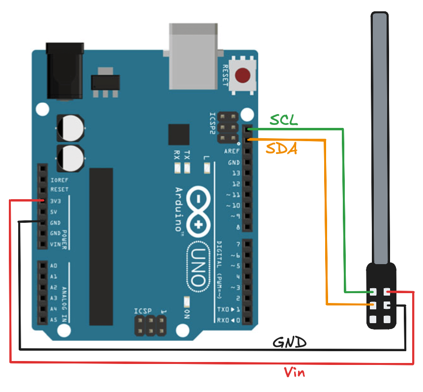
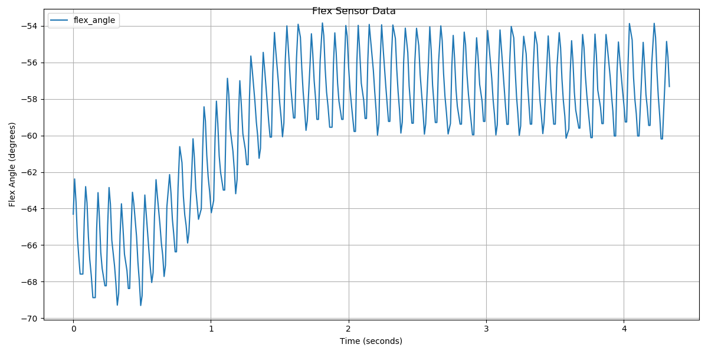
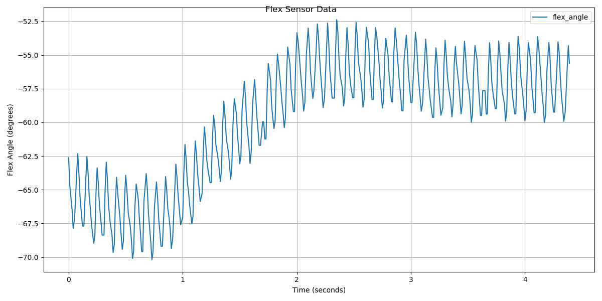
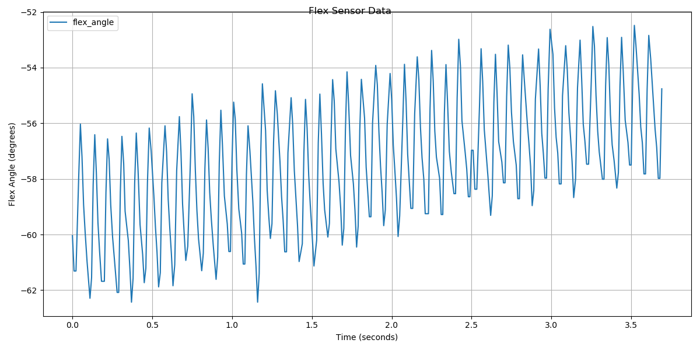
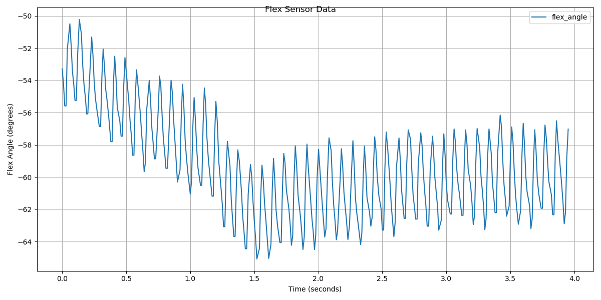

# Flex Sensor ROS Package

ROS package for reading and publishing data from flex sensors connected to Arduino. Also, there is a Python script for plotting sensor data from rosbag, which will be discussed after setup explanation.

## Software setup:
Requirements:
- ROS (noetic or newer)
- Python3 and pyserial module
- dynamixel_workbench package (if you are working with dynamixels on gripper)
- Arduino IDE

First open terminal and clone this project:
```bash
$ git clone https://github.com/leeticija/flex_sensor_arduino_ros_package.git
```
Install required ROS package for dynamixels. If you don't need dynamixels, skip next steps and jump to Hardware setup section.

Navigate to your catkin workspace's src folder:
```
cd ~/catkin_ws/src
```
Clone the required packages:
```
git clone https://github.com/ROBOTIS-GIT/dynamixel-workbench.git
git clone https://github.com/ROBOTIS-GIT/dynamixel-workbench-msgs.git
git clone https://github.com/ROBOTIS-GIT/DynamixelSDK.git
```
Install any missing dependencies:
```
cd ..
rosdep install --from-paths src --ignore-src -r -y
```
Build the workspace:
```
catkin_make
```
Source your workspace:
```
source devel/setup.bash
```

Now you have all the software needed locally on your laptop. 
Try connecting dynamixel to power source and your laptop and run:
```
$ roslaunch sofia.launch
```
This should connect dynamixels and start publishing dynamixel_workbench topics. You can list them with ```$ rostopic list```.

If errors like ```dynamixel with ID: 0 not found``` shows, try changing ID in launch file. Or you can run dynamixels on your own, not via sofia.launch. You can find more info on: http://wiki.ros.org/dynamixel_workbench

## Hardware Setup
Requirements:
- Arduino board
- Flex sensor

Connect your Arduino board with flex sensor (Bendlabs 1-axis flex sensor) like on this schema:



Also, plug Arduino into your laptop via USB cable. Open Arduino IDE and make a new sketch with the code provided in this git repo. Compile it and flash it to your Arduino. The code simply reads data from sensor using I2C protocol, and publishes serial data in JSON format.

Now start the python script that makes new ROS node and publishes /flex_sensor_data topic:
```
$ rosrun flex_sensor_node.py
```
If errors including ```serial port``` not being detected occurs, check read/write permissions for your ```/dev/tty*```, all USB connected devices usually show up in that folder. Find your Arduino USB and dynamixel USB and give them permissions.

After everything is set up and running. You can move gripper with dynamixel through rqt GUI (or you can move it by yourself), start recording rosbag with:
```
$ rosbag record -O output_bag.bag /dynamixel_workbench/dynamixel_state /flex_sensor_data
```

Which will record two relevant topics.

After recording the data you were interested in, you can plot it with python script in ```sensor_data``` folder. This is how you run the plotting for any bag:
```$ python3 rosbag_plotter.py my_data.bag```

In this project, I was comparing flex sensor bending while gripping a cilindrical object with different forces, and also, bending with empty gripper, no item. The goal was to find relation between sensor bending and gripping force and also find the minimum gripping force needed for lifting the object of an unknown softness.

## The recorded data

In the first sample, I introduced the gripping of a small cilinder with the light grip. Concrete recorded data can be inspected in ```/sensor_data/my_data.bag```:


Flex sensor response when gripping small cilinder (more force, ```my_data6.bag```):


Flex sensor response when no item was gripped (light grip, ```itemless0.bag```):


Flex sensor response when no item was gripped (harder grip, ```itemless9.bag```):


We can see that the sensor data always oscillates up and down, but we can also see that these oscillations shift with light and soft grip differently.
